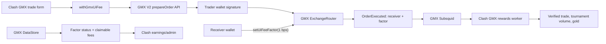

# ADR-0024: GMX UI-fee routing and exact attribution

- Status: Accepted
- Date: 2026-08-14
- Owners: Clash of Perps
- Decision type: Trading integration / revenue attribution

## Context

GMX does not use a string builder code on position orders. A frontend chooses
an EVM `uiFeeReceiver`, that receiver configures its fee factor once through
`ExchangeRouter.setUiFeeFactor`, and each supported order carries the receiver
address. The referral code is a separate GMX affiliate mechanism and must not
be treated as proof that an order paid Clash's UI fee.

The existing Clash GMX flow bound referral `clashofperps`, but omitted
`uiFeeReceiver` from market, limit, close, and TP/SL requests. Its rewards
worker then credited orders based only on the trader's current referral code.
That could miss UI-fee revenue and could count orders that did not route a fee
through Clash.

## Decision

1. Use `0x412A02Ba415e5969596E6f0A35f9439760a3468F` as both the GMX referral owner
   and GMX UI-fee receiver.
2. Configure a 1 basis-point UI fee (`10^26` in GMX 30-decimal factor units).
3. Preserve referral code `clashofperps` as a separate, additive affiliate
   mechanism.
4. Add the receiver through one central request decorator to every supported
   position action: market increase, limit increase, attached TP/SL, market
   decrease, take-profit, and stop-loss.
5. Never accept a receiver override from form state, query parameters, or a
   caller-supplied options object.
6. Read the configured factor from GMX DataStore. Only the receiver wallet may
   call `ExchangeRouter.setUiFeeFactor`; Clash does not store its private key.
7. Attribute tournament volume and trading gold only when the executed GMX
   action contains the exact receiver and exact 1-bps factor. Store that proof
   with the imported fill.
8. Read exact currently claimable UI fees from DataStore keys for every listed
   market and collateral token. Keep referral revenue clearly labelled as an
   estimate because it has a separate accounting and claim path.
9. Clamp worker lookbacks to the exact-attribution cutover at
   `2026-08-14T00:00:00Z` (overrideable through
   `GMX_UI_FEE_ATTRIBUTION_CUTOVER_AT`). Failed proof checks are read-only:
   they never update or delete historical referral-only rows.

## Architecture

## Alternatives considered

### Referral-only attribution

Rejected. A trader referral is persistent account state and does not prove
that a specific order carried Clash's UI-fee receiver.

### Store the receiver private key on the Clash server

Rejected. The factor is a rare owner action and does not justify custodial key
risk. The browser exposes an owner-only activation action instead.

### Estimate all GMX earnings from local volume

Rejected as the primary number. Estimates remain useful for analytics, but
exact unclaimed UI fees are publicly readable from GMX DataStore and must be
reported separately.

### Add the receiver at individual call sites only

Rejected. Independent literals are easy to omit from a newly added order path
or accidentally override. A central decorator makes the routing invariant
testable.

## Consequences

### Positive

- All current GMX position actions use one auditable attribution path.
- Tournament volume and gold are backed by per-order GMX execution proof.
- Admin earnings expose exact claimable UI fees without confusing them with
  unrelated wallet balances.
- No builder/receiver private key is placed in browser bundles or server env.

### Negative

- The receiver wallet must approve one Arbitrum transaction before fees become
  non-zero.
- Exact claimable earnings require batched DataStore reads across current GMX
  markets and tokens.
- Previously imported referral-only fills remain historical records; new
  imports use the stronger UI-fee proof from the deployment cutover onward.

## Validation

- Structural tests enforce one receiver and all GMX prepare-order paths.
- Live unsigned prepare requests must return valid calldata containing the
  receiver for increase, decrease, and conditional orders.
- Worker tests reject zero-factor and foreign-receiver events.
- Earnings tests validate DataStore key construction and token-to-USD math.
- Production verification checks configured env, public service health, and
  the on-chain factor status. A funded trade is not required for deployment.
